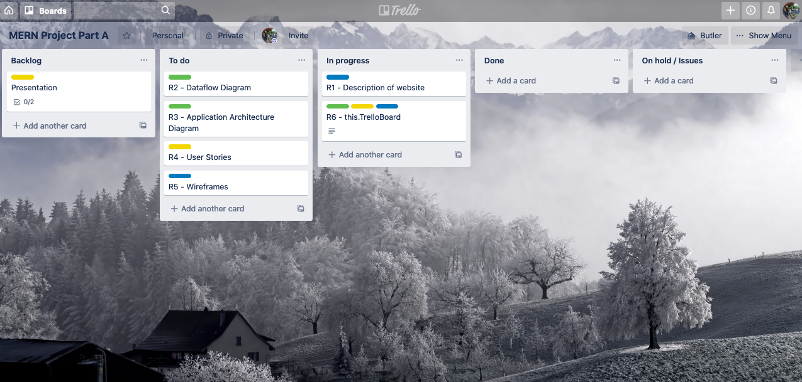
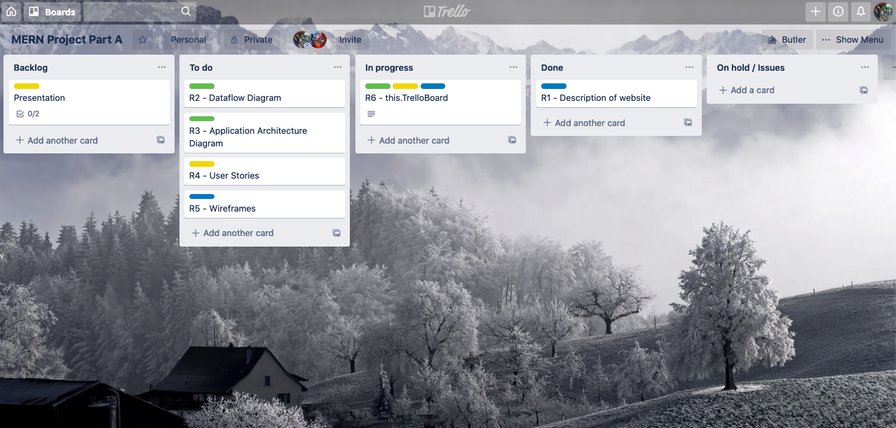

# Real World Application - Part A

## R1

Description of your website, including:

- Purpose
- Functionality / features
- Target audience
- Tech stack

**Purpose**

As we live in an increasingly information-driven age, our mental health is at an increased risk of deteriorating but through this information we have established a universal method of improving our mental state: meditation.
The purpose of this application is to improve ones ability and consistency to meditatie through habit-building and tracking, utilising technology.

**Functionality / Features**

- User registration
- Subscription service
- A quiz to intake users information
- Meditation courses
- Tracking the users progress
- A reward system where the user unlocks badges for completing courses or hitting milestones

**Target Audience**

The target audience for this app is beginner meditators: anyone seeking a more guided way to meditate, including a way to track their progress.

**Tech Stack**

This application will be written entirely in Javascript and divided into two distinct sections:

**_The back end:_**

- Node.js
- Express
- MongoDB

Including the libraries:

- Mongoose
- Atlas
- Passport.js

**_The front end:_**

- React

Including the libraries:

- React Hooks
- React Router
- Axios

---

## R4

<table style="width:100%">
    <tr>
      <th>User Stories</th>
      <th>Acceptance Criteria</th>
    </tr>
    <tr>
      <td>As a user I want to register to login to the website</td>
      <td>
        <ul>
           <li>
            See a register page
           </li>
           <li>
            Able to go to login page and get a link to register page
           </li>
           <li>
            Able to go to see invalid input on the registration page
           </li>
           <li>
            Login to the app after registration
           </li>
        </ul>
      </td>
    </tr>
    <tr>
      <td>As a user I want to choose what type of account on signup for myself</td>
      <td>
        <ul>
          <li>
            See a radio button on which type of user I want to be
          </li>
        </ul>
      </td>
    </tr>
    <tr>
      <td>As a user I want to buy a holiday regardless if I am a vendor or not</td>
      <td>
        <ul>
          <li>
            See a catelogue of holidays
          </li>
          <li>
            See a buy button
          </li>
          <li>
            click on buy button
          </li>
          <li>
            Get to a payment page to enter payment details
          </li>
        </ul>
      </td>
    </tr>
    <tr>
      <td>As a user I want to see a payment confirmation page</td>
      <td>
        <ul>
          <li>
            See a payment success page after inputting credit card details
          </li>
        </ul>
      </td>
    </tr>
    <tr>
      <td>As a user I want to see past purchases</td>
      <td>
        <ul>
          <li>
            See a link on the navbar to go to the past payments
          </li>
          <li>
            on the past payment page, can see the time, the amount and the holiday ordered in a table form
          </li>
        </ul>
      </td>
    </tr>
    <tr>
      <td>As a vendor I want to add products to my listing of products</td>
      <td>
        <ul>
          <li>
            See a link on the navbar to add holiday
          </li>
          <li>
            See a form to enter product/holiday details
          </li>
          <li>
            Submit the form to see if it's successful or not depend on validation
          </li>
        </ul>
      </td>
    </tr>
    <tr>
      <td>As a vendor I want to view holidays in my listing</td>
      <td>
        <ul>
          <li>
            See a link on the navbar to see all products/holidays
          </li>
          <li>
            See the page with a picture, description, price and title of products
          </li>
        </ul>
      </td>
    </tr>
    <tr>
      <td>As a vendor I want edit my listings</td>
      <td>
        <ul>
          <li>
            See a edit button on the listing page for a specific product
          </li>
          <li>
            click on edit button to an edit form to edit the product
          </li>
          <li>
            see a successful edit page afterwards
          </li>
        </ul>
      </td>
    </tr>
  </table>

---

## R5

Wireframes for multiple standard screen sizes, created using industry standard software

https://www.figma.com/file/nvMcT5zXiYqNB8qaKO6kKw/MeditationApp?node-id=1%3A2

---

## R6

