# Real World Application - Part A

## R1 Description of your website, including:

-----------

- Purpose
- Functionality / features
- Target audience
- Tech stack

-----------

## Purpose

Studies into the increasing number of those with mental health concerns have shown a possible link between: 

increased <u>exposure</u> to technology & a <u>decrease</u> in one's *mental state*.

Through habit-building and built-in personable reports tracking, *CMCFlow* will assist people in beginning their journey into meditation which has proven positive effects on mental state.

## Functionality / Features

User registration
A quiz for new students
Meditation courses
Tracking the student's progress
Student Rewards - Reward badges will unlock upon completion of courses, or hitting milestones

## Target Audience

*CMCFlow* is targeted at people who have little to no experience in meditation but would like guidance and a metric to gauge effect.

## Tech Stack

This application will be written entirely in *Javascript* and divided into two distinct sections:

#### The back end:

Node.js
Express
MongoDB
Including the libraries:
 
- *Mongoose*
- *Atlas*
- *Passport.js*

#### The front end:
React
Including the libraries:
 
- *React Hooks*
- *React Router*
- *Axios*

## R2

---
## R3 Application Architecture Diagram

.png?raw=true)

---

## R4

<table style="width:100%">
    <tr>
      <th>User Stories</th>
      <th>Acceptance Criteria</th>
    </tr>
    <tr>
      <td>As a user I want to register to login to the website</td>
      <td>
        <ul>
           <li>
            See a register page
           </li>
           <li>
            Able to go to login page and get a link to register page
           </li>
           <li>
            Able to go to see invalid input on the registration page
           </li>
           <li>
            Login to the app after registration
           </li>
        </ul>
      </td>
    </tr>
    <tr>
      <td>As a user I want to choose what type of account on signup for myself</td>
      <td>
        <ul>
          <li>
            See a radio button on which type of user I want to be
          </li>
        </ul>
      </td>
    </tr>
    <tr>
      <td>As a user I want to buy a holiday regardless if I am a vendor or not</td>
      <td>
        <ul>
          <li>
            See a catelogue of holidays
          </li>
          <li>
            See a buy button
          </li>
          <li>
            click on buy button
          </li>
          <li>
            Get to a payment page to enter payment details
          </li>
        </ul>
      </td>
    </tr>
    <tr>
      <td>As a user I want to see a payment confirmation page</td>
      <td>
        <ul>
          <li>
            See a payment success page after inputting credit card details
          </li>
        </ul>
      </td>
    </tr>
    <tr>
      <td>As a user I want to see past purchases</td>
      <td>
        <ul>
          <li>
            See a link on the navbar to go to the past payments
          </li>
          <li>
            on the past payment page, can see the time, the amount and the holiday ordered in a table form
          </li>
        </ul>
      </td>
    </tr>
    <tr>
      <td>As a vendor I want to add products to my listing of products</td>
      <td>
        <ul>
          <li>
            See a link on the navbar to add holiday
          </li>
          <li>
            See a form to enter product/holiday details
          </li>
          <li>
            Submit the form to see if it's successful or not depend on validation
          </li>
        </ul>
      </td>
    </tr>
    <tr>
      <td>As a vendor I want to view holidays in my listing</td>
      <td>
        <ul>
          <li>
            See a link on the navbar to see all products/holidays
          </li>
          <li>
            See the page with a picture, description, price and title of products
          </li>
        </ul>
      </td>
    </tr>
    <tr>
      <td>As a vendor I want edit my listings</td>
      <td>
        <ul>
          <li>
            See a edit button on the listing page for a specific product
          </li>
          <li>
            click on edit button to an edit form to edit the product
          </li>
          <li>
            see a successful edit page afterwards
          </li>
        </ul>
      </td>
    </tr>
  </table>

---

## R5

Wireframes for multiple standard screen sizes, created using industry standard software

**Website Size**

Landing: 
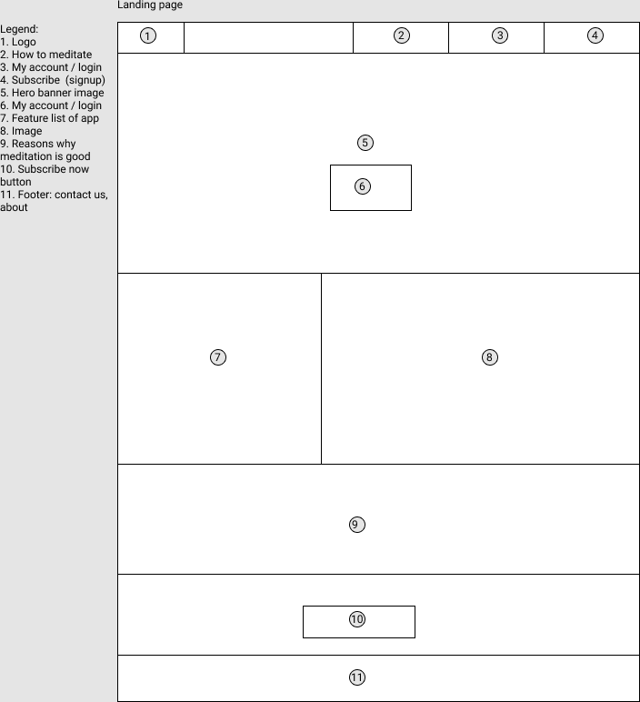

Home: 
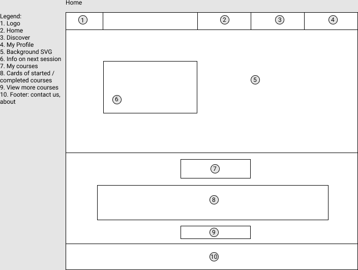

Meditation App Popup: 
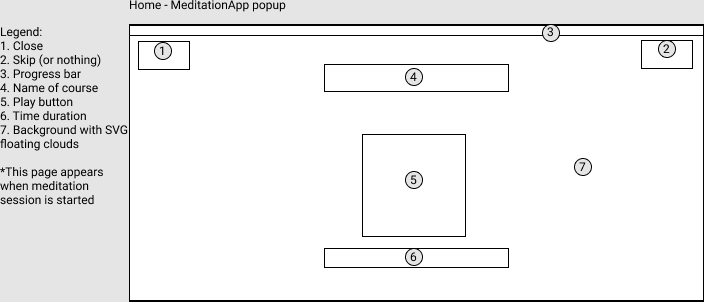

Discover: 
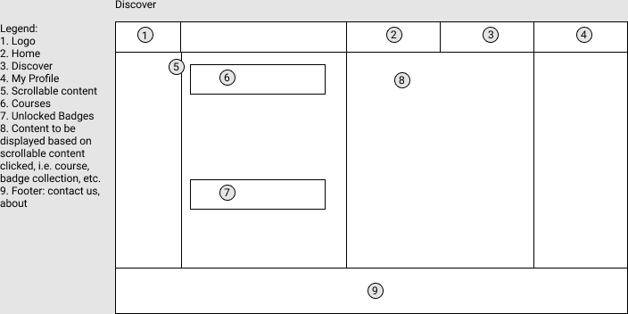

Discover - Specific Course: 
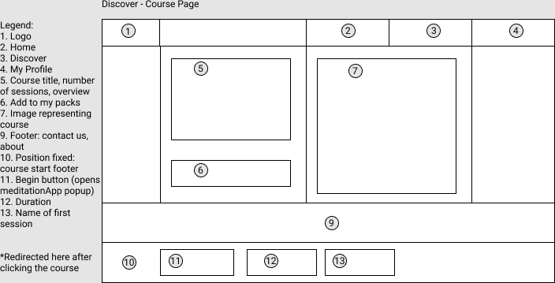

My Profile - Stats: 
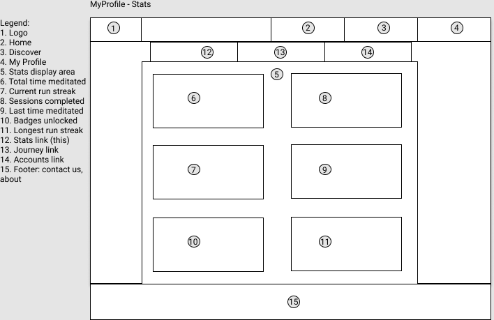

My Profile - Journey:
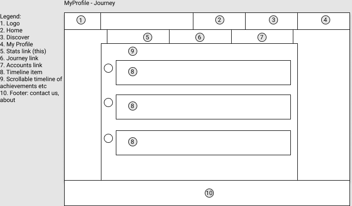

My Profile - Journey Popup: 
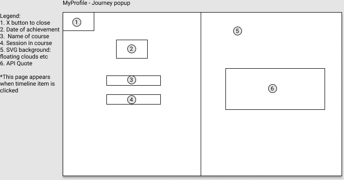

MyProfile - Account: 
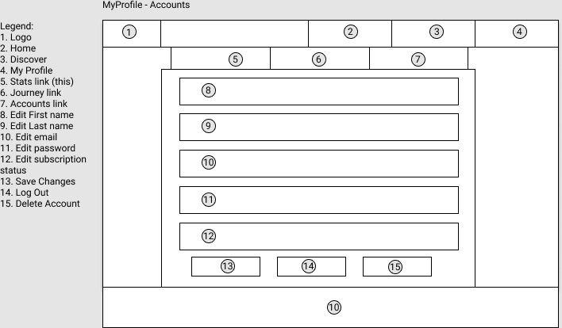

**iPad Size**

==placeholder==

**Mobile Size**

==placeholder==

---

## R6

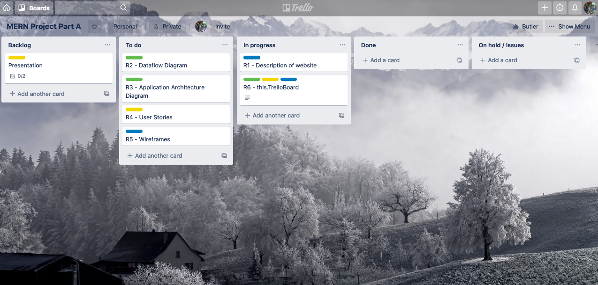
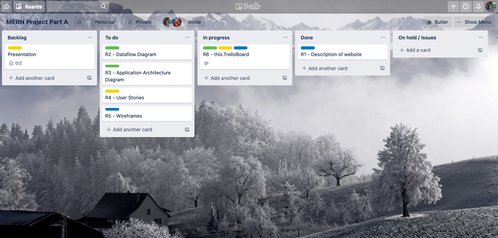
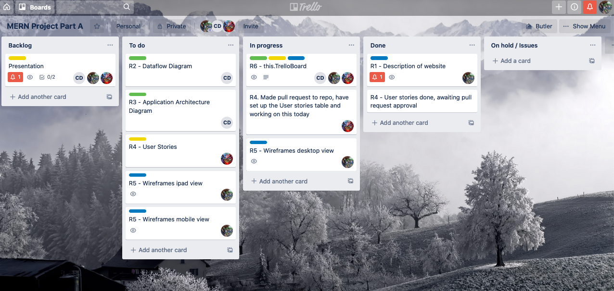

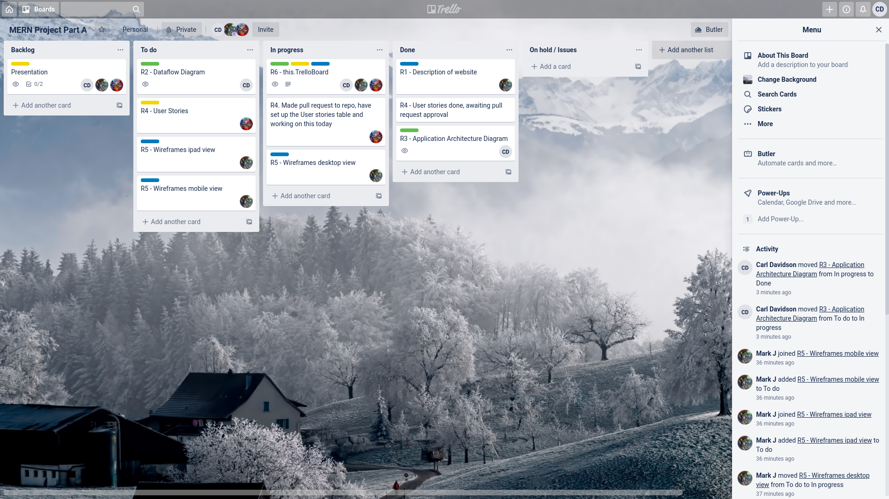
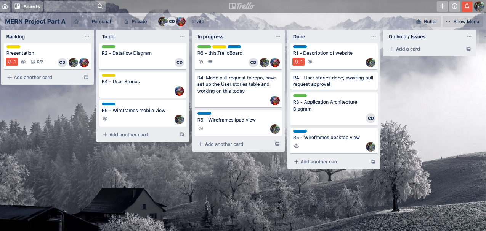