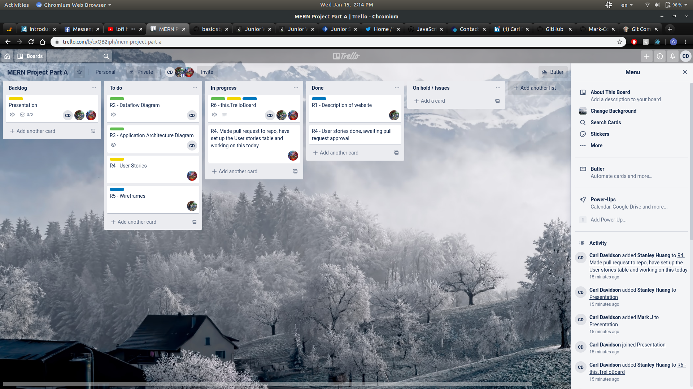

# Real World Application - Part A

## R1 Description of your website, including:

---

- Purpose
- Functionality / features
- Target audience
- Tech stack

---

## Purpose

Studies into the increasing number of those with mental health concerns have shown a possible link between:

1. Increased _exposure_ to technology

2. Decrease in one's _mental state_.

Through habit-building and built-in personable reports tracking, _CMCFlow_ will assist people in beginning their journey into meditation which has proven positive effects on mental state.

## Functionality / Features

- User registration
- A quiz for new students
- Meditation courses
- Tracking the student's progress
- Student Rewards - Reward badges will unlock upon completion of courses, or hitting milestones

## Target Audience

_CMCFlow_ is targeted at people who have little to no experience in meditation but would like guidance and a metric to gauge effect.

## Tech Stack

This application will be written entirely in _Javascript_ and divided into two distinct sections:

#### The back end:

Node.js
Express
MongoDB
Including the libraries:

- _Mongoose_
- _Atlas_
- _Passport.js_

#### The front end:

React
Including the libraries:

- _React Hooks_
- _React Router_
- _Axios_

## R2

---

## R3 Application Architecture Diagram

.png?raw=true>)
Including the Main libraries:

- React Hooks
- React Router
- Axios
- Redux
- React Redux
- Redux Thunk
- Reactstrap
- Possible more UI libraries to handle graphics

---

## R4

<table style="width:100%">
    <tr>
      <th>User Stories</th>
      <th>Acceptance Criteria</th>
    </tr>
    <tr>
      <td>As a user I want to register or login to the website because I want to use the application</td>
      <td>
        <ul>
           <li>
            See an authentication page
           </li>
           <li>
            Able to go to the authentication page and either login or register
           </li>
           <li>
            Able see invalid input on the registration page
           </li>
           <li>
            Able to seen invalid input when trying to log in
           </li>
           <li>
           Have the option to authenticate by external providers like Facebook, Google
           </li>
           <li>
            Login to the app after registration
           </li>
        </ul>
      </td>
    </tr>
    <tr>
      <td>As a user I want to choose what type of meditation to do from the dashboard because I want the freedom to choose my course</td>
      <td>
        <ul>
          <li>
          Navigate to the discover page to choose meditation courses to start, i.e. “beginner”, “intermediate” or “expert”
          </li>
        </ul>
      </td>
    </tr>
    <tr>
      <td>As a user I want to continue where I left off from the previous meditation session because I can resume where I left off from the last session without extra navigation work</td>
      <td>
        <ul>
          <li>
            See options on the page to choose "resume"
          </li>
        </ul>
      </td>
    </tr>
    <tr>
      <td>As a user I want see a dashboard page because I want a centralized location to visualize my profile, data, past achievements and do operations related to the application</td>
      <td>
        <ul>
          <li>
            See a timeline of the type of meditation I have done
          </li>
          <li>
            See a personalized message for motivation
          </li>
          <li>
            click on button to start the meditation session
          </li>
          <li>
            see a button to initiate an one time only donation
          </li>
        </ul>
      </td>
    </tr>
    <tr>
      <td>As a user I want to see a donation confirmation page because I want to know if a payment has gone through or not.</td>
      <td>
        <ul>
          <li>
            See a payment success page after inputting credit card details
          </li>
        </ul>
      </td>
    </tr>
    <tr>
      <td>As a user I want to see past donations because I want to know the history of my contribution to the application</td>
      <td>
        <ul>
          <li>
            See a a component that lists the donations
          </li>
          <li>
            On the donation component, can see the time, the amount and the details of the donations.
          </li>
        </ul>
      </td>
    </tr>
    <tr>
      <td>As a user I want to see an About page because I want to find out more about the app before registering.</td>
      <td>
        <ul>
          <li>
            See a description of the app
          </li>
        </ul>
      </td>
    </tr>
    <tr>
    <td>As a user I want to see stats based on my performance so far on time meditated, run-streak, sessions completed and last time meditated because I want to know what I have achieved and at the same time stay motivated</td>
    <td>
      <ul>
        <li>
          See my awards / badges / achievements unlocked
        </li>
      </ul>
    </td>
    </tr>
    <tr>
      <td>As a user I want to get a timer component for the meditation session because that's the basic feature of any meditation apps, I need to know when it finishes and if I need to pause or resume I can do it.</td>
      <td>
        <ul>
          <li>
            Be able to play, pause and resume the meditation
          </li>
          <li>
            Get notified that a meditation is finished with a notification of audio
          </li>
          <li>
            Repeat the meditation again or get redirected back to the dashboard to choose a new meditation session
          </li>
        </ul>
      </td>
    </tr>
</table>

---

## R5

Wireframes for multiple standard screen sizes, created using industry standard software

**Website Size**

Landing:

Home:

Meditation App Popup:

Discover:

Discover - Specific Course:

My Profile - Stats:

My Profile - Journey:

My Profile - Journey Popup:

MyProfile - Account:

**iPad Size**

Landing:

Home:

Meditation App Popup:

Discover:

Discover - Specific Course:

My Profile - Stats:

My Profile - Journey:

My Profile - Journey Popup:

MyProfile - Account:

**Mobile Size**

==placeholder==
https://www.figma.com/file/nvMcT5zXiYqNB8qaKO6kKw/MeditationApp?node-id=9%3A12

---

## R6

